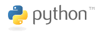

Getting started with Python ... 
===============================

Nothing special here, just trying to learn some Python

### But why Python?
> Python community has its own unique character. Python has a culture which finds an ideal balance between fast-moving innovation and diligent caution. It emphasizes readability, minimizes "magic," treats documentation as a first-class concern, and has a traditon of well-tested, backward-compatible releases in both the core language and its ecosystem of libraries. It blends approachability for beginners with maintainability for large projects, which has enabled its presence in fields as diverse as scientific computing, video games, systems automation, and the web. (Source: [Heroku](https://blog.heroku.com/python_and_django))

Python Learning Path
====================

## PART I (beginner)
> For total beginners that have no previous programming experience.
* [ ] [Google Python Class](https://youtu.be/tKTZoB2Vjuk?list=PLC8825D0450647509) (YouTube Video)
* [ ] [How to Think Like a Computer Scientist](http://interactivepython.org/runestone/static/thinkcspy/index.html) (Interactive online)
* [ ] [A Byte of Python](https://python.swaroopch.com/first_steps.html) (Book online)
* [ ] [Python for You and Me - _PYM_ ](http://pymbook.readthedocs.io/en/latest/) (Book online)
* [ ] [CodeAcademy Python Course](https://www.codecademy.com/learn/python) (Interactive online)
* [ ] [Learn Python The Hard Way](https://learnpythonthehardway.org/book/) (Book online)
* [ ] [CS Principles: Big Ideas in Programming](http://interactivepython.org/runestone/static/StudentCSP/index.html) (Interactive online)
* [ ] http://www.pythonlearn.com/
* [ ] http://automatetheboringstuff.com/

    * [ ] write automated tests from the beginning

## PART II (intermediate)
> For peope that have at least some previous programming experience even if it's from other languages.
* [ ] [Dive Into Python 3](http://www.diveintopython3.net/) (Book online)
* [ ] [Python for Computational Science and Engineering](http://www.southampton.ac.uk/~fangohr/training/python/pdfs/Python-for-Computational-Science-and-Engineering.pdf) (PDF)
* [ ] [Problem Solving with Algorithms and Data Structures](http://interactivepython.org/runestone/static/pythonds/index.html) (Interactive online)
* [ ] [Python How to Program] (Python How to Program) (Youtube)
* [ ] [The Hitchhiker’s Guide to Python!](http://docs.python-guide.org/en/latest/) (Book online)
* [ ] [Python Challenge](http://www.pythonchallenge.com/) (Solve riddles!)

## PART III (specialization)
> Where do you want to go after Part I and II? There are a lot of special areas and it is hard to master them all thus you should decide where you want to put your focus.
* [ ] Backend/API development
* [ ] Frontend/GUI development
* [ ] Web Application/Apps development (front- & backend)
    * [ ] [Django-Girls](https://djangogirls.org/) (Tutorial)
* [ ] Quality assurance & Test automation
* [ ] Game development
* [ ] Data mining & analytics
* [ ] System/Server administration (DevOps)
* [ ] AI & machine Learning
* [ ] Hacking
* [ ] ...

## Editor (IDE) recommendation
 - for PART I: https://repl.it/languages/python3 (no installation require)
 - for PART II: PyCharm CE / IntelliJ CE / VisualStudio 2015+
 - for PART III: one of PART II + some specialized tools or frameworks

GIT configuration
=================
What do I need to do to configure git properly for Github?

NOTE: Assuming cmder, git and git-lfs is already installed (e.g. with chocolatey)

NOTE: Assuming Github is configured to keep your email private

1. `git config --global user.name "tset-noitamotua"`
2. `git config --global user.email "tset-noitamotua@users.noreply.github.com"`
3. `git config --global credential.helper wincred`
    
    NOTE: first time you use e.g. `git push` you will be prompt for credentials though
